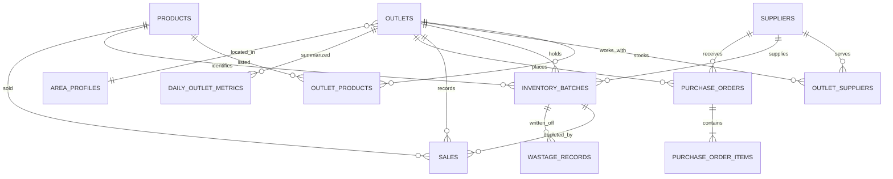

# ER diagram

```mermaid
erDiagram
 OUTLETS ||--o{ OUTLET_PRODUCTS : stocks
 PRODUCTS ||--o{ OUTLET_PRODUCTS : listed
 OUTLETS ||--o{ OUTLET_SUPPLIERS : works_with
 SUPPLIERS ||--o{ OUTLET_SUPPLIERS : serves
 OUTLETS ||--o{ INVENTORY_BATCHES : holds
 PRODUCTS ||--o{ INVENTORY_BATCHES : identifies
 SUPPLIERS ||--o{ INVENTORY_BATCHES : supplies
 INVENTORY_BATCHES ||--o{ SALES : depleted_by
 OUTLETS ||--o{ SALES : records
 PRODUCTS ||--o{ SALES : sold
 PURCHASE_ORDERS ||--|{ PURCHASE_ORDER_ITEMS : contains
 OUTLETS ||--o{ PURCHASE_ORDERS : places
 SUPPLIERS ||--o{ PURCHASE_ORDERS : receives
 INVENTORY_BATCHES ||--o{ WASTAGE_RECORDS : written_off
 OUTLETS ||--o{ DAILY_OUTLET_METRICS : summarized
 OUTLETS }o--|| AREA_PROFILES : located_in
```
